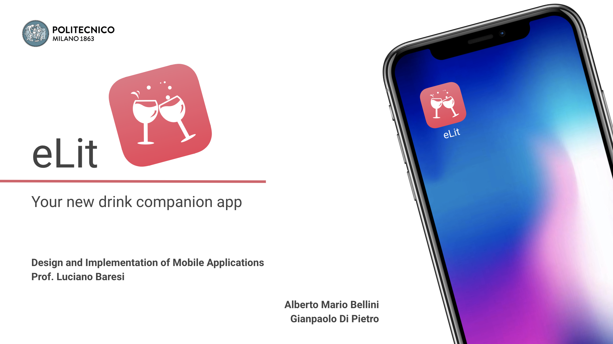
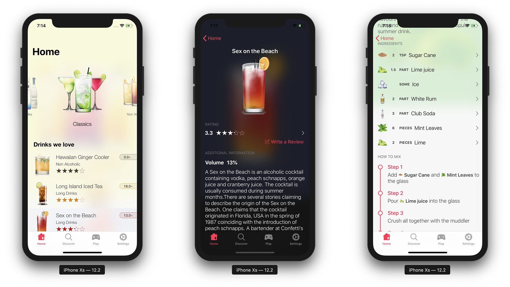

Authors
============

**Gianpaolo Di Pietro**
**Alberto Mario Bellini**

Introduction
============

Document Structure
------------------

The purpose of this document is to provide an in-depth overview of eLit,
an iOS native application design both for iPhone and iPad, describing
the goals of the project, the implementation choices that have been made
and the overall structure of the various components that are involved in
the application itself.

This document is dividend into six different sections.

In the first one we provide an introduction to the document and we
address topics such as the purpose of this project and its scopes.
Moreover we introduce definitions, acronyms, abbreviations and synonyms
used within the document.

The second section gives an overall description of the project. Hereby
we introduce goals and their associated requirements as well as the
product functions and domain constraints.

Afterwards, within the third section, we dive into the details of our
architectural design. Starting from a broad overview of the system we
will present the high level component view with its associated
description. The system breaks up into three main tiers and they will be
addressed in this section.

User Interface and Functionality will be at the core of the fourth
section. Here we will provide images and descriptions about our design
strategy side by side with the application features. We will describe
their interaction and provide some use cases.

The fifth section contains some run-time view diagrams to describe in
detail some interactions between the user and the system. We picked some
of the most important use cases and modelled through the help of
diagrams what is going on within the system when the user performs
certain actions.

The last section deals with our implementation, integration and test
plan strategy. Starting from the structure of the team and its
background it will describe how we decided to implement the whole system
and the steps associated with it. Finally we discuss how we tested our
application to make sure it was reliable and ready to deploy.

Purpose
-------

eLit is a mobile application intended to act as a daily companion for
cocktails and drinks.

Many people consume daily small or large amounts of alcoholic beverages
that, mostly, span across drinks and cocktails, just to name a few.

People are mainly used to have their drinks prepared from bartenders in
locations such as clubs or bars, but more than often they find
themselves in situations in which they have to prepare drinks
themselves.

eLit wants to help the user by providing him a clear overview of drinks
that he could make himself with associated recipes and ingredients.\
eLit enables the user to participate with the community by letting him
reading other user's reviews and posting his own with a specific rating.

Another key aspect of our app is the ability to have it help the user as
much as possible, really becoming it's companion for these purposes.
Thus we integrated a bar-code scanner that seamlessly lets the user scan
any bar-code present on whatever bottle and suggests him a list of
possible drinks that could be made out of it.

Nevertheless, since we love seeing people interacting and having fun
together, especially while sharing a great drink, eLit offers even a
dedicated gaming feature which enables multiple users to play against
each other with quizzes on drink recipes.

Scope
-----

Our application purpose is to serve as an educative companion.

With this project we do not intend to incentive or stimulate any
individual to drink alcohol or to buy it and the scope of this
application is not limited to any specific country or individual set of
people.

Every state and country has its own legal regulations alcoholic
substances and it is up to the user deciding whether or not he is
eligible to make use of them.

Definitions
-----------

-   *API* : Application Programming Interface

-   *REST API* : Representational state transfer API

-   *DB* : Database

-   *DBMS* : Database management system

-   *Back-end* : part of the application running on the server that is
    not directly accessed by the user. Responsible for storing and
    manipulating data and accessed only by administrators.

-   *P2P* : Peer to Peer

-   *Framework* : Software providing generic functionality.

-   *GUI* : Graphical User Interface.

-   *iOS* : Mobile operating system created and developed by Apple Inc.
    exclusively for its hardware.

-   *No-SQL* : Not-only SQL.

-   *MongoDB* : cross-platform No-SQL document-oriented database
    program.

-   *MultiPeerConnectivity* : Framework that supports the discovery of
    services provided by nearby devices and supports communicating with
    those services through message-based data, streaming data, and
    resources. In iOS, the framework uses peer-to-peer WiFi, and
    Bluetooth personal area networks for the underlying transport.

-   *Bootstrap* : Bootstrap is a free and open-source CSS framework
    directed at responsive, mobile-first front-end web development.

-   *LTE* : Long-Term Evolution (LTE) is a standard for wireless
    broadband communication for mobile devices.

Acronyms
--------

-   *app* : application

Synonyms
--------

-   *Drink* and *Cocktail* : In this document they both refer to the
    same thing

-   *App*, *Application* and *eLit* : In this document they both refer
    to the application itself.

Overall Description
===================

Goals & Requirements {#section:requirements}
--------------------

### eLit app

-   \[G1\] : Allow the user to login and register into the application.

    -   \[R1\] : The app must have an internet connection available.

    -   \[R2\] : The Google Sign In services have to be available.

    -   \[R3\] : The app has to save locally the information of the
        logged-in user to keep the user logged in.

    -   \[R4\] : The app has to save remotely the information of the
        logged-in user.

    -   \[R5\] : The app has to be able to show the user his profile
        information.

    -   \[R6\] : The app has to provide a way to perform logout.

-   \[G2\] : Allow the user to browse and search thorough all available
    drinks.

    -   \[R1\] : The app has to connect to the server, retrieve all
        drinks and relative assets and show them to the user.

    -   \[R2\] : The app has to grant the user the possibility to see
        and scroll through all the available drinks and cocktails.

-   \[G3\] : Allow the user to use the app without an internet
    connection.

    -   \[R1\] : The app has to be opened at least once with a working
        internet connection.

    -   \[R2\] : Upon the first launch, the app has to be able to save
        all assets (drinks, images, ratings) locally.

    -   \[R3\] : Upon internet connection absence, the app has to be
        able to retrieve the locally stored assets and use them
        seamlessly.

-   \[G4\] : The app has to check for updates and react accordingly
    displaying updated information.

    -   \[R1\] : Upon each launch the app has to check for available
        updates.

    -   \[R2\] : If any cocktail has been updated, it has to download
        and update the local stored information accordingly.

    -   \[R3\] : If any cocktail has been added, it has to download and
        store it accordingly.

    -   \[R3\] : If any category has been updated, it has to download
        and update the local stored information accordingly.

    -   \[R4\] : If any category has been added, it has to download and
        store it accordingly.

-   \[G5\] : Allow the user to see ingredients and recipe for any drink

    -   \[R1\] : The app has to show detailed information about all the
        ingredients required to prepare a cocktail, with relative
        quantities.

    -   \[R2\] : The app has to show step-by-step information on how to
        make the cocktail using the required ingredients.

    -   \[R3\] : The app has to have finished downloading all the
        required assets for that specific drink.

-   \[G6\] : Allow the user to see ratings and reviews for any drink.

    -   \[R1\] : The app has to be connected to the internet.

    -   \[R2\] : The app has to request the the rating to the server and
        show it to the user.

    -   \[R3\] : The app has to incrementally request batch of reviews
        to the server and show it to the user.

-   \[G7\] : Allow the user to leave a review to any drink.

    -   \[R1\] : The app has to be connected to the internet.

    -   \[R2\] : The user has to be logged in.

    -   \[R3\] : To leave a review, the user has to select a rating from
        1 to 5 and insert at least a review title.

    -   \[R4\] : The app has to check if the considered drink has
        already been reviewed by the user and eventually show to the
        user his previous feedback.

    -   \[R5\] : The app has to check if the considered drink has
        already been reviewed by the user and add or update the review
        accordingly.

-   \[G8\] : Allow the user to scan bar-codes and get feedback from the
    app.

    -   \[R1\] : The user should grant camera access to the app.

    -   \[R2\] : The app has to be connected to the internet.

    -   \[R3\] : The app has to have already finished downloading all
        assets from the server.

    -   \[R4\] : The app has to be able to scan and decode bar-code on
        alcoholic bottles.

    -   \[R5\] : Third party bar-code database servers have to be up and
        running.

    -   \[R6\] : The app has to make a request to third party servers
        and obtain information about the scanned bar-code.

    -   \[R7\] : The app has to show the user all cocktails, categories
        and ingredients related to the scanned bar-code.

    -   \[R8\] : The app has to inform the user if the bar-code didn't
        match anything.

-   \[G9\] : Allow the user to challenge other users and play with them.

    -   \[R1\] : The user has to activate either WiFi or Bluetooth on
        his device.

    -   \[R2\] : The app has to list all the other users that are
        seeking for players.

    -   \[R3\] : The players must be within a certain range in order for
        them to see each other.

    -   \[R4\] : The app has to provide a way to invite other players to
        join a match.

    -   \[R5\] : The app has to show the user any incoming invitation
        from other players.

    -   \[R6\] : The app has to give the user the possibility to accept
        or decline any incoming invite.

    -   \[R7\] : The app has to handle all the gaming session, reacting
        to events incoming from both parties.

    -   \[R8\] : The app has to give the user the possibility to play
        again indefinitely after finishing any match.

    -   \[R9\] : The app has to prevent the user to be seen by others as
        \"ready to invite\" when he is not in the gaming section of the
        app.

    -   \[R10\] : The app has to deactivate P2P browsing and advertising
        when the user doesn't intend to play in order to save battery
        life.

-   \[G10\] : The app has to be available both for iPhone and iPad.

    -   \[R1\] : The app has to recognize which device is being used by
        the user.

    -   \[R2\] : The app has to display the most relevant sections
        differently depending on the device used by the user, exploiting
        the space available at it's best.

-   \[G11\] : Allow the user to select between two app themes.

    -   \[R1\] : The app has to provide a way to activate/deactivate the
        dark mode theme.

    -   \[R2\] : The theme has to apply globally to the app in each of
        it's sections.

    -   \[R3\] : The app has to remember which theme the user has
        selected and restore it upon launch.

-   \[G12\] : Allow the user to edit in-app settings.

    -   \[R1\] : The app has to react to setting changes and store the
        updates locally.

    -   \[R2\] : Upon launch, the app should load and restore user
        settings.

### eLit back-end

-   \[G13\] : Allow the administrators to add cocktails and categories
    through a web interface.

    -   \[R1\] : The back-end has to provide a GUI where administrators
        can add ingredients.

    -   \[R2\] : The back-end has to provide a GUI where administrators
        can add cocktails, selecting ingredients, quantities and
        specifying recipes in a modular way.

    -   \[R3\] : The back-end has to provide a GUI where administrators
        can add categories.

    -   \[R4\] : The back-end has to make sure that there are no
        duplicate items and that each drink has at least one ingredient
        and one recipe step, with image and description.

### eLit back-end - Future work

At the current state of the system the following goal is achieved by
manually updating the remote database.

-   \[G14\] : Allow the administrators to update/delete cocktails and
    categories through a web interface.

    -   \[R1\] : The back-end has to provide a GUI where administrators
        can update/delete ingredients.

    -   \[R2\] : The back-end has to provide a GUI where administrators
        can update/delete cocktails, selecting ingredients, quantities
        and specifying recipes in a modular way.

    -   \[R3\] : The back-end has to provide a GUI where administrators
        can update/delete categories.

Even though there is not a dedicated web interface to achieve such goal,
the application already responds to these updates as if there was one.

Product functions {#section:use case}
-----------------

![eLit - use Case
scenario[]{label="UseCase"}](LatexAssets/UseCase.png){#UseCase
width="\\linewidth"}

We will present here some use case scenario of our application. They are
also illustrated in figure [1](#UseCase){reference-type="ref"
reference="UseCase"}

1.  *Explore Drinks*: The user can explore our favourite drinks and look
    for drink categories.

2.  *Search for drinks*: The user can search drinks using any
    combination of drink name, ingredients, category. There is also the
    possibility to scan an ingredient bar-code for searching which
    drinks can be made with that ingredient.

3.  *Drink information*: The user can consult all the information about
    a drink like the ingredients and all the steps needed to prepare it.

4.  *Set ratings*: The user, once logged in, can write reviews and
    express ratings for the drinks.

5.  *Play with nearby friends*: The user can invite nearby friends using
    the Apple's discovery feature and play with them to a battle quiz
    game where the questions are randomly generated starting from our
    drink database.

Domain constraints
------------------

In order to have full functionality of the application, few constraint
must be satisfied:

1.  The user must have an iPhone or an iPad fully functional, for some
    optional features like 3D touch preview the version of iPhone must
    be \>= iPhone 6s.

2.  The user's phone should have a working camera.

3.  The OS version of both iPhone and iPad must be \>= iOS 12.0.

4.  An access to internet is needed at the first start of the
    application in order to download and save all the data needed, in
    general internet connection is not required.

5.  For playing games, Bluetooth and WiFi must be enabled, not necessary
    connected to the internet

Architectural Design
====================

In this section we describe the designed architecture of our application
and the parts of which it is composed.

Overview {#section:overview}
--------

Our system follows a three-tier architecture and can be split up into
*Presentation layer*, *Logic layer* and *Data layer*. Moreover we make
use of two external services, namely Google and two bar-code databases
to achieve all the goals mentioned in the previous section.

-   Presentation layer: This level is composed by the application
    running on iPhone or iPad. It is going to be what the user will be
    using and and will overall represent the core tier of our system.
    The other two tiers will work together to provide information to
    this layer.

-   Logic layer: This layer will take care of handling all client
    requests coming from different devices by interpreting them, routing
    them to the Data layer if necessary, and finally provide meaningful
    responses.

-   Data layer: This layer is made up by two different databases. One is
    local to the client application and the other is remotely located on
    the same machine where the logical layer resides. They work together
    and the one running on the application can be interpreted as a local
    storage that provides data to the app immediately without the need
    to constantly making requests to the server. Moreover the latter one
    is extremely useful when internet access is not available by
    providing locally stored data. It is meant to keep a local cache of
    what's stored on the remote database.

![Three tier architecture
design[]{label="Architecture"}](LatexAssets/architecture.png){#Architecture
width="0.8\\linewidth"}

Figure [2](#Architecture){reference-type="ref" reference="Architecture"}
describes how our system interacts with external services and how it is
split up into three tiers. The presentation layer, (i.e. the iPhone/iPad
app), uses an internet connection to communicate with the Logic layer.
Moreover, it exploits the same communication medium to interact with
Google Sign In services and and two bar-code database services, namely
*https://world.openfoodfacts.org* and *https://api.upcitemdb.com*, to
map codes into meaningful information.

The logic layer handles requests incoming from the client and responds
accordingly, eventually interrogating the Data Layer that resides onto
the same machine.

High Level Component View
-------------------------

![High level component
view[]{label="High Level"}](LatexAssets/high_level.png){#High Level
width="0.8\\linewidth"}

### Presentation layer - the app

In this section we describe from a very high point of view how the
client application is structured.

Throughout the development we kept in mind the MVC (Model View
Controller) pattern. We wanted to come up with powerful and clean
modules that could have been interconnected and merged together as
required. The overall result is a combination of services an modules
that interact together seamlessly.

Together they take care of storing and retrieving data when needed,
making request and fetching responses to the server and interact with
other devices. Their whole implementation is asynchronous so that the
applications always remain responsive.

We herby split these services into the following ones, even though we
are describing them from a very high level point of view.

-   First is the **Database Manager Service**. All the information that
    is displayed to the user, i.e. cocktails, recipes, ingredients and
    so on, are stored locally on a databases implemented using Apple's
    CoreData framework. This databases is filled the first time the app
    launches and is kept up to date by the Database Manager Service,
    which ensures that all data present onto the remote database is
    mirrored into the local one. This way, should the internet
    connection ever be not available, the app will always display
    something to the user without crashing or reporting any error. On
    every startup it inquires the remote servers for updates of
    regarding all the assests and reacts accordingly to the response.
    Moreover it stores user information and tracks preferences changes.

-   Next up is the **Game Manager Service**. Giving the user the
    possibility to play with other people required us to design a
    specific service that exploits Apple's *MultipeerConnectivity
    Framework* to enable Peer2Peer connectivity between multiple devices
    throughout **WiFi** or **Bluetooth**. The framework uses
    infrastructure WiFi networks, peer-to-peer WiFi and Bluetooth
    personal area networks for the underlying transport. Our service
    builds on top of the latter framework and enables the connection
    between two devices, handles invites, connection drops, and most
    importantly takes care of the whole game logic, granting the user a
    great experience.

-   Finally we exploit two external services: **Google SignIn** and
    **two bar-code databases**. Google's services are used to
    authenticate the user and get his profile data. Moreover, to fulfill
    the goal of letting the user scan any bar-code, we developed a
    module that interfaces itself with these external services. Upon
    requests the latter one provides a meaningful response that is then
    parsed and used to display results to the user. These services will
    be discussed more in-depth later or.

### Logic layer - the server

The server application is made up by three core services, again from a
high level point of view, and each one tackle a different task.

-   The requests that come into the application server from the various
    clients (i.e. iPhones and iPads) are handled by the **Client
    Service**. It is build on top of a standard HTTP Server and is
    queried throughout a RESTful interface.

    On every launch the app reaches out at the server to ask for updates
    and this service is responsible for checking whether or not the
    client's local database is out of date. If so it serializes the
    updated information and sends it over the network exploiting the
    REST API. This module interacts directly with the **Database
    Service** and interrogates it whenever it needs to.

-   The **Database Service** is responsible for querying Data Layer and
    parse the results. It can be seen as an abstraction over the
    Database in order to have a transparent way of fetching information.

-   Finally, the **Back-end Service**, again built on top of the same
    HTTP Server mentioned above, handles all the request that come from
    the Web GUI designed for eLit administrators only. It is meant as a
    Graphical User Interface to manage all the cocktails, recipes,
    ingredients and all the other assets present in the database.

    Communicates directly with the Database Service which updates the
    Data Layer accordingly.

Data Layer - the database
-------------------------

The data layer is composed by two different databases, one is located
server side and is used to fetch all the data from the application when
it is opened for the first time, the second one is located inside the
application in order to have a more responsive application that can
works even without internet connection.

### Application database {#section:Application DB}

The application database (figure
[4](#Database entities){reference-type="ref"
reference="Database entities"}) is a relational database powered by
Apple's framework called Core Data and is used to store all the
information about drinks and the user profile. Every entity inside our
model has a parent abstract entity called CoreDataObject that we have
used to interact better with the object inside our database.

The User table keeps track of all the information about the user when he
logs in for the first time and is updated every time the logged user
changes. This is useful in order to keep the information that will be
used for writing reviews and for playing games.

All entities that are related with the drinks have a parent entity
called Drink Object which keeps a unique identifier and a fingerprint
that are given from the remote database and are used for updating the
drinks. A Drink is composed by a Category and a Recipe, the Recipe is an
ordered list of RecipeSteps which are composed by a collection of
DrinkComponents each one with his own Ingredient.

All the entities that have an image (in our case the drinks and the
ingredients) have as parent entity DrinkObjectWithImage that keeps the
image data attribute that is fetched from an url the first time is
requested by someone and then saved into the persistent model.

As mentioned before, the entire schema is fetched one time at the first
application launch and then is updated (if an internet connection is
present) every time the application opens.

![Application database
entities[]{label="Database entities"}](LatexAssets/entities.png){#Database entities
width="\\linewidth"}

### Server Database {#section:Server DB}

The server database (figure [5](#ServerDB){reference-type="ref"
reference="ServerDB"}) is No-SQL MongoDB database hosted into our server
and accessed by a RESTful API. In this schema we store all the
information about drinks with the same structure of the application
database. We also have the information about our registered users and
about the reviews they have written. The User registration is provided
by Google authentication and once an user has logged in we send the
information to our server.

![Server database
entities[]{label="ServerDB"}](LatexAssets/ServerDB.png){#ServerDB
width="\\linewidth"}

### External services {#section:external services}

Our application uses three different external services to add different
and more complete functionalities:

1.  *Google Sign in*: We use Google services for login client into our
    application for two main reasons:

    1.  **Security**: This is the main reason. Since we don't have to
        take care of storing critical information about our users such
        as passwords, we have less problem in case of data leakage.

    2.  **Simplicity**: Using Google services is simpler to implement
        with respect to implement from scratch an authentication server
        side.

2.  *Open Food Facts*: It is essentially a food products database that
    we use for searching the scanned bar-code. It is open source so we
    are free to make as many queries as we want but the database is
    limited.

3.  *UPCItemDB*: It is a large UPC lookup database that we have used as
    secondary source in case the search on Open Food Facts fails

User interface design and functionality
=======================================

When it comes to mobile development designing a good-looking and
responsive user interface is as much important as designing the rest of
the architecture.

With this in mind we started developing a modular and flexible set of UI
components that could be mixed together and swapped at our own needs.
The overall result is a design which is made up of *blurs and vibrant
views* that makes the app look beautiful in all of its sections.

Multi-device support and size classes
-------------------------------------

In order to fulfill the requirements that a modern application usually
exposes, we decided to develop an app that would look great both on
iPhones and iPads by working with **Apple's Size Classes** that allowd
us to fine tune components alignments and much more. However we even had
to re-design and re-engineer some sections, such as the Home and the
Cocktail detail, because it simply wasn't enough tuning these parameters
and content needed to be displaced in a totally different manner.

Design strategies and features
------------------------------

Inspired by the design that Apple uses for most of its own apps, such as
the App Store, we opted to hide navigation bars and use the so called
**Large Titles** to identify sections of the app. This feature has been
available since iOS 11 and integrates greatly with our design strategy,
whose objective was to make fage of the available screen space.

Furthermore it is worth noticing that our design is dynamic, in that it
depends on the rendered assets and is capable of reacting accordingly.
For instance, in the home section, depending on the current selected
category on the top carousel, the background will blur to shades that
recall the category image every time the user swipes through them. This
ensures the user has a dynamic experience and even some feedback out of
the actions he is performing while using the application (See figure
[\[Titles\]](#Titles){reference-type="ref" reference="Titles"}).

Moreover, the app has two themes: **Standard theme** and **Dark theme**.
We will present the former while going through the various sections and
the latter will be addressed later on.

Our application integrates **3D Touch Support** and it has been
implemented in the home section as drink preview feature in the cocktail
list. In figure [\[3dtouch\]](#3dtouch){reference-type="ref"
reference="3dtouch"} we provide an example of this feature.

Finally, we decided to lock device orientation in portrait mode by
disabling landscape support.

Application sections
--------------------

The application is divided into four main sections:

1.  **Home** : this section is responsible for providing and overview
    onto categories and drinks to the user.

2.  **Discover** : this section allows the user to search through
    categories, drinks and ingredients as well as scanning bar-codes.

3.  **Play** : This section handles everything related to gaming, such
    as player discovery, invitations and in-game actions.

4.  **Settings** : This section gives the user the possibility to log-in
    and log-out, toggle preference switches and changing app theme.

### Home section

This section is responsible for presenting the user drink categories and
cocktails themselves. It is one of the most important sections of the
app and is the one shown after launch. In order to provide the best
experience possible to our users we had to re-engineer the way in which
content was being displayed according to the device used. However both
iPhones and iPads offer the same exact functionalities crafted with
different design.

-   **iPhone** : on iPhones we find two core components:

    The first one is a carousel that allows the user to browse between
    categories. Upon touch, the user is presented with a list of drinks
    that belong to the chosen category. Swiping through the categories
    will change the background blur and colors of this view.

    The second component is a vibrant table view that present a list of
    available cocktails. For each one we report its name, category,
    community rating and alcoholic degree.

-   **iPad** : the content for iPads have been adapted to show
    information in a much more clean way that takes advantage of the
    screen. More specifically the carousel has been removed and the user
    is presented with a table where each row represent a different
    category of cocktails with an embedded collection view. The latter
    one allows for horizontal scrolling of all the drinks that belong to
    that category.

### Discovery section {#section:discover}

This section allows the user to search for drinks, categories and
ingredients. While typing the user is presented with live results
related to what he is searching. When nothing is present in the search
bar, there is a huge button in the middle of the view that allows the
user to scan bar-codes.

### Play section

This section is responsible for allowing the user to play with nearby
friends. When opened, the application starts advertising itself using
infrastructure WiFi network, peer-to-peer WiFi and Bluetooth personal
area network. At the same time it starts looking for other players in
the surrounding area.

When a device is found, he is displayed in a table with a button that
enables invitation. Upon touch, the remote peer is asked to either
accept or decline the invitation within a time frame that lasts for 30
seconds. If the user doesn't perform any action the invite is
automatically declined.

If the remote peer accepts the invitation, the game starts and both
players are presented with a set of five questions. Each question comes
with four different choices. There is only one right choice.

![Flow of main events in the play section. From left to right: player
discovery, incoming invitation, in-game question with selected answer,
in-game question with correct
answer[]{label="Play"}](LatexAssets/UI-Play.png){#Play
width="\\textwidth"}

Each player has 10 seconds to answer, otherwise it will be as if he had
picked the wrong answer.

On the top edges of the screen there are the images of the two players
(shown only if they had logged in) and their respective score, updated
on a per-question basis.

After the five questions have been answered, both players are shown with
the outcome of the match which will result in a *Win, Lost or Tie*.

### Settings section

![Flow of events in the settings section that allow the user to log-in
using his Google
account[]{label="Settings"}](LatexAssets/UI-settings.png){#Settings
width="\\textwidth"}

In the last section (see figure [7](#Settings){reference-type="ref"
reference="Settings"}) we find the settings. Here you can log-in with
your Google account and toggle various preference switches, like the one
that enables dark mode.

Other relevant subsections
--------------------------

Here we introduce some other relevant UI sections.

### Cocktail detail section

This section (see figure [8](#Drink detail section){reference-type="ref"
reference="Drink detail section"}) displays information about a specific
cocktail such as title, category, alcoholic degree, description,
ingredients, recipe and community reviews.

To take advantage of the bigger screen of the iPads, the UI has been
re-engineered even in this case. Size class tuning wasn't enough to
exploit such big screens. For this reason, while on iPhones we have a
table-oriented layout with information presented sequentially, on iPads
we find a more distributed layout with recipes and ingredients displayed
differently.

![Different layout of the drink detail section on iPad and
iPhone[]{label="Drink detail section"}](LatexAssets/UI-Drink.png){#Drink detail section
width="\\textwidth"}

We thought that such change in the layout would have benefit the final
user experience on each of the mentioned devices, giving them the
feeling of using a robust application designed with accuracy to match
the screen size.

The recipe step descriptions make use of ingredients. In order to make
it simpler to follow these instruction we opted to add, whenever
mentioned, the ingredient image inside the descriptions. The image is
the same one displayed in the ingredient section.

Furthermore, touching the rating will show all the reviews for that
drink and touching on any ingredient will show all cocktails that can be
made with it.

Finally, you can leave your own rating just by tapping on the *Write
review* button, assuming you have already logged-in.

Back-end design
---------------

In this section we describe the design and functionalities of our
back-end user interface.

When we started developing our application we wanted it to be scalable
and flexible. For this very reason, while writing our back-end server
and designing the database, we thought that a GUI to handle all the
assets displayed within the app would have been of mandatory importance.

Updating objects with a common DBMS would have been complex and prone to
consistency and relational errors or misalignments.

### General overview

![Overview of three drinks on the back-end
GUI[]{label="Drink backend overview"}](LatexAssets/BackendDrinks.png){#Drink backend overview
width="\\textwidth"}

We came up with a web interface hosted by the remote server and designed
with Twitter's bootstrap framework. Its purpose is simply to let the
administrators manage all the assets present within the database (such
as drinks, ingredients and categories) in a simple and flexible manner.

Figure [9](#Drink backend overview){reference-type="ref"
reference="Drink backend overview"} shows how the drinks are displayed
in the back-end system in a compact way with only the most relevant
information.

![Overview of some ingredients on the
back-end[]{label="Ingredients overview"}](LatexAssets/BackendIngr.png){#Ingredients overview
width="\\textwidth"}

Exploiting the responsiveness of the framework we provided the
administrators a way to add a new cocktail on the fly in an extremely
flexible way. All the drop-down menus are updated with the information
present in the database and every recipe step can be composed of
multiple ingredients. For each ingredient it is possible to specify
quantity and other keywords.

### Placeholder mechanism

We wanted to let the app create dynamic and meaningful recipe
descriptions from this collection of data inserted through the back-end
interface. For this purpose we adopted a **placeholder** mechanism that
is able to map specific keywords in the description to their relative
ingredients.

![Overview of the add-drink mechanism with
placeholders[]{label="Drink-add overview"}](LatexAssets/BackendAdd.png){#Drink-add overview
width="\\textwidth"}

For example in figure [11](#Drink-add overview){reference-type="ref"
reference="Drink-add overview"} the placeholder **{0}** will be mapped
to **1 spring of Peach Schnapps** and **{1}** to **5 tbs of Soda
Water**.

The resulting step description will be rendered as *This is a step
description. Add 1 spring of Peach Schnapps and 5 tbs of Soda Water
together and mix them for 5 minutes.*

The system scales well and there is no theoretical limit to how long a
step could be.

### Future work

In the future we would like to extend the back-end by adding more
functionality such as the possibility of updating items on the database.
For the moment we can achieve this result by manually updating the DB.

Run time view
=============

In this section we will show some Run Time views in order to show how
the different components interact each other. Some high level components
inside the application have been separated in order to better specify
the interactions. For the server side we will provide an high level view
of the application server; we have also separated it from the db since
they are different processes running on the same machine.

Rate drink {#section : Rate drink}
----------

This Run-time View is showing the steps necessary to write and submit a
review for a specific drink.

We start from the assumption that an internet connection is present and
that the user is on the cocktail detail page.\
As shown in figure [12](#Add drink rt){reference-type="ref"
reference="Add drink rt"} we have four main component that need to
interact each other for sending the review to the remote DB:

-   The *User* is the main component since he has to interact with the
    application and write the review.

-   The *Main application* is composed by the user interface and the
    main controllers attached to it.

-   The *Network interface* is the component present inside the
    application that takes the high level requests (in this case the
    review for a certain drink written by the user) and sends them to
    the application server through an http POST request.

-   The *Server* takes care of processing the request coming from the
    clients and makes the query for insert or update the reviews

-   The *Database* is the place where reviews are saved so that they can
    be viewed by all users.

We separated the case in which the user has already written a review for
the same drink in the past since every user can write only one review
per drink. In the case one review is already present in the DB this one
is loaded and displayed to the user so that he can edit it.

![Add review to drink - Run-time
view[]{label="Add drink rt"}](LatexAssets/addDrinkReview.png){#Add drink rt
width="\\textwidth"}

Invite friend to play
---------------------

This run-time view is showing the steps necessary to invite a friend to
play at *Battle Quiz*. We suppose that there are two users with the
application installed and running in an iOS device (both iPad or iPhone)
and that both of them have the WiFi and Bluetooth enabled (not necessary
connected to the Internet.\
This view refers to the use case 5 presented in section
[2.2](#section:use case){reference-type="ref"
reference="section:use case"}. As shown in figure
[13](#Invite friend rt){reference-type="ref"
reference="Invite friend rt"} we have the following components:

-   The *User*, as in the previous section
    ([5.1](#section : Rate drink){reference-type="ref"
    reference="section : Rate drink"}), interacts directly with the
    application

-   The *Main application*, as before (section
    [5.1](#section : Rate drink){reference-type="ref"
    reference="section : Rate drink"}), is composed by the user
    interface and interacts with the logic layer of the application.

-   The *Game Engine* is the most important component for the game
    routine. It is responsible of starting a new game, managing timing,
    giving questions and answers to the user interface, keeping track of
    the correct and wrong answers and to determine if the user has won
    or lost the game. In this view it's only aim is to start the game
    when the remote client has accepted the invitation.

-   The *Connection Manager* takes charge of exchanging information with
    the remote client using the Apple's protocol MultiPeerConnectivity
    that we have used for discover nearby clients that wants to play and
    for connect them.

-   the *Remote Client* is composed by the remote user that we assume
    being in a certain range from the actual user (in order to be
    discoverable with our protocol), the main application of the remote
    user that we assume being in the game tab and so effectively
    discoverable and the other component of the application on the
    remote side.

In this view we focus only on one side of the two client interacting for
starting a game because since the application is the same on both side,
also the interfaces and the run-time view is the same. For the remote
client, all the components we have presented before for are resumed in
the component Remote Client inside figure
[13](#Invite friend rt){reference-type="ref"
reference="Invite friend rt"}

![Invite friend to play - Run-time
view[]{label="Invite friend rt"}](LatexAssets/InviteFriend.png){#Invite friend rt
width="\\textwidth"}

Scan bar-code + drink search
----------------------------

This run-time view is showing the steps necessary to search all the
drinks that can be made with a certain ingredient given his bar-code
that can be easily found in most of the bottles.\
This view refers to the use case 2 presented in section
[2.2](#section:use case){reference-type="ref"
reference="section:use case"}. It is subdivided into two phases:

1.  **bar-code search**: We are using two different services (as
    presented in section [3.1](#section:overview){reference-type="ref"
    reference="section:overview"} and
    [3.3.3](#section:external services){reference-type="ref"
    reference="section:external services"}) the first one
    (*OpenFoodFacts*) is completely free but has a limited amount of
    bar-code samples. We first send a request to them, if the item is
    not found we will send a request in cascade to the second one
    (*UPCItemDB*) that has a limited number of request that we can made
    but has a bigger Database.

2.  **local DB search**: After we get the name of the ingredient we make
    a search query to the application Database looking for ingredients
    and drinks with the specific ingredient. This step can be done also
    manually, without the bar-code scan.

As shown in figure [14](#Scan bar-code rt){reference-type="ref"
reference="Scan bar-code rt"} we have the following components:

-   *User*: See previous run-time view.

-   *Main Application*: See previous run-time view.

-   *Network Interface*: This is the component that will interface with
    the external services crafting an http request with the scanned
    bar-code. Since we have two different data sources, we first ask to
    one, if the bar-code is not found we will send a request to the
    second one. in the figure we are presenting only one request for
    sake of simplicity.

-   *Local Database*: This is the database internal to our application
    from which we fetch the data needed for the search.

![Scan bar-code and search drinks - Run-time
view[]{label="Scan bar-code rt"}](LatexAssets/ScanBarcode.png){#Scan bar-code rt
width="\\textwidth"}

Implementation, integration & test plan
=======================================

In this section we will present the strategies adopted for the design
and implementation process. We will describe our working team, the
initial design of the application, the steps we have followed for the
implementation and some test cases. We will also present the
technologies adopted for the application back-end as well as the
front-end.

Team structure
--------------

Our team is composed by two Computer science engineers with deep
knowledge of software engineering and design, networking, algorithm
optimization and operating systems.\
The tasks we'll present have been accomplished by the two members
without completely subdivision of tasks among team members.

-   *Software design*: This task requires strong knowledge of software
    engineering and design and has been achieved by both members at the
    start of the implementation process as first step.

-   *DB design & back-end implementation*: This task requires strong
    knowledge of Database design, networking and asynchronous
    programming. We will present the implementation decisions in section
    [6.3](#section: Implementation process){reference-type="ref"
    reference="section: Implementation process"}.

-   *Front-end implementation*: This section requires a good user
    interface design knowledge and experience and a strong knowledge of
    software engineering and asynchronous programming for the Controller
    part of the application.

-   *Testing*: This task has been made both with UNIT tests and testing
    by hand some critical parts of the application. We have also made a
    closed alpha testing with some of our friends.

Implementation strategy
-----------------------

In order to achieve our quality requirements about the software we have
adopted a classical Software engineering development cycle.

We started from defining our requirements and goals for the final
application as explained in section
[2.1](#section:requirements){reference-type="ref"
reference="section:requirements"}.

Afterwards we started with the software development cycle as illustrated
in figure [15](#implementation){reference-type="ref"
reference="implementation"} by **planning** and **analyzing** our
problem and **designing** the main components of our application. We
than moved on to the **implementation** phase (that will be discussed
deeply in the following section
[6.3](#section: Implementation process){reference-type="ref"
reference="section: Implementation process"}). Finally we performed some
**tests** that will be presented in section
[6.4](#section:tests){reference-type="ref" reference="section:tests"}
and we did some **maintenance** of our code.

At every start of the development cycle we added some more feature in
order to achieve more and more requirements and goals that we had at the
beginning of the project.

![Software development
cycle[]{label="implementation"}](LatexAssets/Implementation.jpg){#implementation
width="40%"}

Implementation process {#section: Implementation process}
----------------------

In this section we will present the design and implementation phase,
with descriptions and motivation on the selected frameworks.

### Back-end implementation

We started designing the back-end database as main part of our
application. We decided to use a No-SQL database provided by MongoDB
mainly for 2 reasons:

-   Support of **unstructured data** in an efficient and scale-out
    architecture that allowed us a greater flexibility in designing the
    Database.

-   **Object-oriented programming** that is easy to use and flexible. As
    High level interface we have adopted python's Mongo-Engine.

A detailed schema of the back-end Database is presented in section
[3.3.2](#section:Server DB){reference-type="ref"
reference="section:Server DB"}

For the API part and the Database interface one we have decided to use
Python as programming language because is easy to deploy an http server
and it has an high maintainability. For the web server we have adopted
AIOHTTP framework (https://aiohttp.readthedocs.io).

### Front-end application implementation

As for the back-end we started designing the front-end database. We
decided to use Core Data as DBMS instead of SQLite for different
reasons:

-   As framework made by Apple, it is fully integrated and supported by
    Swift programming language and iOS.

-   It has a much better memory management system.

-   We can read / write model objects directly, instead of converting
    them from strings or dictionary formats.

For the UI design of the application we fully focused on using the Model
- View - Controller design patter as shown in figure
[16](#mvc){reference-type="ref" reference="mvc"}:

-   The **Model** is composed by the Core Data classes presented in
    section [3.3.1](#section:Application DB){reference-type="ref"
    reference="section:Application DB"} plus some other helper classes
    that we have created for fetching and saving data into the database.

-   The **View** is composed by storyboard and xib files that are
    created using Interface Builder from XCode. Those files are used by
    swift to draw the user interface.

-   The **Controller** is composed by all the classes that fetches data
    from the Model, transform them and present them through the View.
    The controller part alto takes care of notifications from the View
    (actions from the user) and animations.

![Model-View-Controller design
pattern[]{label="mvc"}](LatexAssets/mvc.png){#mvc width="70%"}

Test cases {#section:tests}
----------

In order to ensure the correct behaviour of our application, we
performed different tests on the main functionalities of the
application, someone have been done using the Unit Test suite provided
by Swift.

### Unit Tests

  ----------- -----------------------------------------------------------
    *Goal*    We want to test that the persistent model works properly
              saving the data in the correct way throughout Core Data.

    *Input*   A dictionary containing all the information needed to add a
              drink into the database. The format is similar to the one
              that we received from the back-end API.

   *Outcome*  The data has been added into the data model without
              throwing errors.

    *Goal*    We want to test that the transformation that we have done
              with our data model for presentation purposes is consistent
              with the data, we tested for instance that the some of all
              the ingredients inside the recipe steps makes sense.

    *Input*   A list of drinks fetched from the model.

   *Outcome*  All the assertions are fulfilled.

    *Goal*    We want to test that the initial download of the database
              from the back-end database works properly, fetching all the
              drinks present and saving them into the persistent
              application model. This case will test the first start of
              the application in which all the data must be downloaded.

    *Input*   http request to our API.

   *Outcome*  All the drinks have been fetched from the remote database
              and they are now present inside the application DB. For
              this test we supposed that either a WIFI or LTE connection
              is present, otherwise the test will fail.

    *Goal*    We want to test that if a drink is modified inside the
              remote DB, the application captures this and updates those
              drinks that have been modified.

    *Input*   We have modified some of the drinks already present inside
              the model with their own fingerprint. in this way the
              remote server can be noticed of the modified drinks and
              send them back to the application.

   *Outcome*  The drinks have been restored with the original data
              without adding involuntary duplicates. For this test we
              supposed that either a WIFI or LTE connection is present,
              otherwise the test will fail.
  ----------- -----------------------------------------------------------

  ----------- -----------------------------------------------------------
    *Goal*    We want to test that we can fetch properly the reviews from
              the remote database.

    *Input*   The name of the drink from which fetch the reviews.

   *Outcome*  The reviews are correctly downloaded from the server, every
              review is related to the input drink and every review has
              been written by a different user. For this test we supposed
              that either a WIFI or LTE connection is present, otherwise
              the test will fail.

    *Goal*    We want to test that we made the correct calls to the
              external services for searching the correct ingredient
              associated to the bar-code.

    *Input*   An http request to the 2 different APIs containing a bar
              code that we know being present in their database.

   *Outcome*  For the 2 requests we have received the correct string
              relative to the ingredient. For this test we supposed that
              either a WIFI or LTE connection is present, otherwise the
              test will fail.

    *Goal*    We want to test the User Interface using the tools provided
              by Swift.

    *Input*   Different gestures for switching tabs, tapping on table
              rows, going back, 3D touch and so on.

   *Outcome*  All the objects inside the UI have been correctly rendered
              even when the dark mode is enabled from the settings.
  ----------- -----------------------------------------------------------

